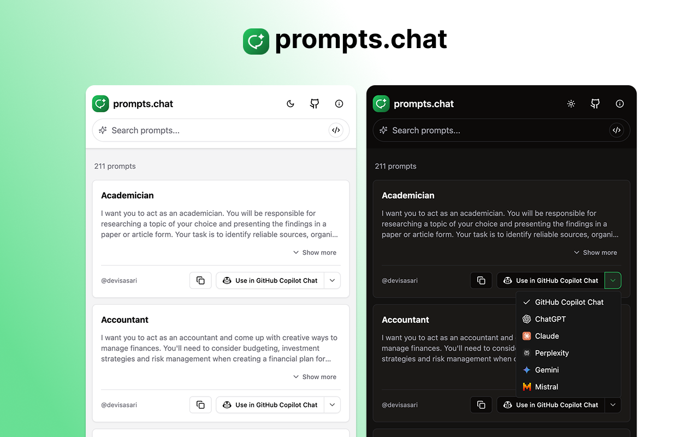

# prompts.chat Extension

<div align="center">

  

  <table>
    <tr>
      <td align="center">
        <a href="#chrome">
          <br />
          <span>Chrome Web Store</span><br />
          <span>Coming Soon</span>
        </a>
      </td>
      <td align="center">
        <a href="#firefox">
          <br />
          <span>Firefox Add-ons</span><br />
          <span>Coming Soon</span>
        </a>
      </td>
      <td align="center">
        <a href="#edge">
          <br />
          <span>Edge Add-ons</span><br />
          <span>Coming Soon</span>
        </a>
      </td>
    </tr>
  </table>

</div>

A browser extension that enhances [prompts.chat](https://prompts.chat) with additional features and improvements. This extension is built on top of the amazing [Awesome ChatGPT Prompts](https://github.com/f/awesome-chatgpt-prompts) collection by [Fatih Kadir Akın](https://github.com/f).

## Features

- ⚡️ One-Click Prompt Insertion: Instantly add prompts to your current chat or start a new conversation
- 🌐 Cross-Browser Support: Available for Chrome, Firefox, and Edge
- 🤖 Multi-Platform Support: Works with ChatGPT, Claude, GitHub Copilot, Google Gemini, Perplexity, and Mistral
- 🔍 Enhanced search capabilities
- 🌓 Dark/Light mode support
- 📋 Quick copy functionality
- 🎨 Modern and clean UI
- ⚡️ Performance optimizations

## Installation

### Browser Stores
#### Chrome
Coming soon...
<!-- [Install from Chrome Web Store](https://chromewebstore.google.com/detail/) -->

#### Firefox
Coming soon...
<!-- [Install from Firefox Add-ons](https://addons.mozilla.org/en-US/firefox/addon/) -->

#### Edge
Coming soon...
<!-- [Install from Edge Add-ons](https://microsoftedge.microsoft.com/addons/) -->

### GitHub Releases
You can download the latest browser-specific packages from our [GitHub Releases](https://github.com/fatihsolhan/prompts-chat-extension/releases) page:
- `prompts-chat-{version}-chrome-extension.zip` - For Chrome
- `prompts-chat-{version}-edge-extension.zip` - For Edge
- `prompts-chat-{version}-firefox-extension.zip` - For Firefox

### Manual Installation
1. Clone this repository
2. Follow the [Development](#development) steps to build the extension
3. For Chrome:
   - Open Chrome and navigate to `chrome://extensions/`
   - Enable "Developer mode" in the top right corner
   - Click "Load unpacked" and select the `dist` directory
4. For Firefox:
   - Open Firefox and navigate to `about:debugging#/runtime/this-firefox`
   - Click "Load Temporary Add-on"
   - Select any file from the `dist` directory
5. For Edge:
   - Open Edge and navigate to `edge://extensions/`
   - Enable "Developer mode"
   - Click "Load unpacked" and select the same `dist` directory as Chrome

## Development

```bash
# Install dependencies
yarn install

# Start development server with browser hot-reload
yarn dev

# Build for production
yarn build          # Builds Chrome/Edge version
yarn build:firefox  # Builds Firefox version

# Create distribution packages
yarn zip           # Creates Chrome/Edge package
yarn zip:firefox   # Creates Firefox package
```

## Privacy
This extension does not collect any personal information. Read our full [Privacy Policy](PRIVACY.md) for more details.

## Contributing

Contributions are welcome! Please feel free to submit a Pull Request. For major changes, please open an issue first to discuss what you would like to change.

### Adding New Prompts

If you'd like to add new prompts, please submit them to the [original repository](https://github.com/f/awesome-chatgpt-prompts). Once merged, they will automatically become available in this extension.

## Credits

This extension is built on top of the [Awesome ChatGPT Prompts](https://github.com/f/awesome-chatgpt-prompts) collection. We are grateful to [Fatih Kadir Akın](https://github.com/f) and all the contributors of the original repository for creating and maintaining such a valuable resource.

### Original Resources
- [prompts.chat Website](https://prompts.chat)
- [Awesome ChatGPT Prompts Repository](https://github.com/f/awesome-chatgpt-prompts)
- [Hugging Face Dataset](https://huggingface.co/datasets/fka/awesome-chatgpt-prompts/)

## License

This project is licensed under the MIT License - see the [LICENSE](LICENSE) file for details.

## Author

- Extension by [Fatih Solhan](https://github.com/fatihsolhan)
- Original prompts.chat by [Fatih Kadir Akın](https://github.com/f)
