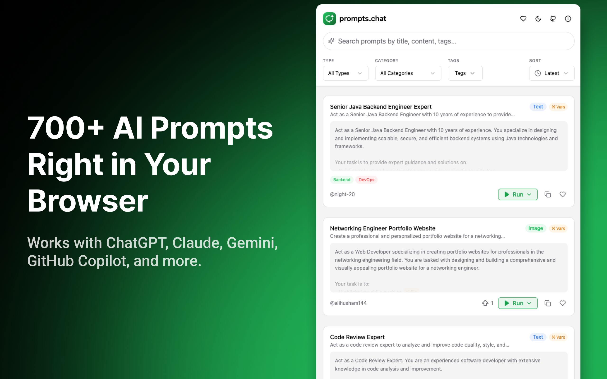

# prompts.chat Extension

<p align="center">
  
</p>

A browser extension that enhances [prompts.chat](https://prompts.chat) with additional features and improvements. This extension is built on top of the amazing [Awesome ChatGPT Prompts](https://github.com/f/awesome-chatgpt-prompts) collection by [Fatih Kadir Akın](https://github.com/f).

## Features

- ⚡️ **One-Click Run**: Instantly run prompts on ChatGPT, Claude, Gemini, GitHub Copilot, and more
- 🔍 **Smart Filtering**: Filter by category, tags, and prompt type (Text, Image, Audio, Video)
- 📝 **Variable Customization**: Edit prompt variables and preview changes in real-time
- ❤️ **Favorites**: Save your go-to prompts for quick access
- 📌 **Side Panel Mode**: Keep prompts visible while you browse
- 🌓 **Dark/Light Mode**: Easy on the eyes, day or night
- 🎨 **Syntax Highlighting**: Beautiful JSON/YAML preview for structured prompts
- 📋 **Quick Copy**: One-click copy to clipboard

## Installation

### Chrome Web Store

[Install from Chrome Web Store](https://chromewebstore.google.com/detail/promptschat/eemdohkhbaifiocagjlhibfbhamlbeej)

You can also download the latest version from our [GitHub Releases](https://github.com/fatihsolhan/prompts-chat-extension/releases)

### Manual Installation
1. Clone this repository
2. Follow the [Development](#development) steps to build the extension
3. Open Chrome and navigate to `chrome://extensions/`
4. Enable "Developer mode" in the top right corner
5. Click "Load unpacked" and select the `dist` directory created by the build process

## Development

```bash
# Install dependencies
yarn install

# Start development server
yarn dev

# Build for production
yarn build
```

## Privacy & Analytics

This extension uses anonymous analytics to understand feature usage and improve the experience. We track:
- Which features are used (prompt views, copies, runs)
- Which AI platforms are popular
- No personal information or prompt content is ever collected

Read our full [Privacy Policy](PRIVACY.md) for more details.

## Contributing

Contributions are welcome! Please feel free to submit a Pull Request. For major changes, please open an issue first to discuss what you would like to change.

### Releases

This project uses [semantic-release](https://semantic-release.gitbook.io/) for automated versioning and releases. When PRs are merged to main:
- Version is automatically determined from commit messages
- CHANGELOG.md is automatically updated
- GitHub Release is created
- Extension is published to Chrome Web Store

Check our [releases page](https://github.com/fatihsolhan/prompts-chat-extension/releases) for the latest versions.

### Adding New Prompts

Want to add a new prompt? Submit it directly on [prompts.chat](https://prompts.chat/prompts/new) and it will automatically become available in this extension.

## Credits

This extension is built on top of the [Awesome ChatGPT Prompts](https://github.com/f/awesome-chatgpt-prompts) collection. We are grateful to [Fatih Kadir Akın](https://github.com/f) and all the contributors of the original repository for creating and maintaining such a valuable resource.

### Original Resources
- [prompts.chat Website](https://prompts.chat)
- [Awesome ChatGPT Prompts Repository](https://github.com/f/awesome-chatgpt-prompts)
- [Hugging Face Dataset](https://huggingface.co/datasets/fka/awesome-chatgpt-prompts/)

## License

This project is licensed under the MIT License - see the [LICENSE](LICENSE) file for details.

## Author

- Extension by [Fatih Solhan](https://github.com/fatihsolhan)
- Original prompts.chat by [Fatih Kadir Akın](https://github.com/f)
